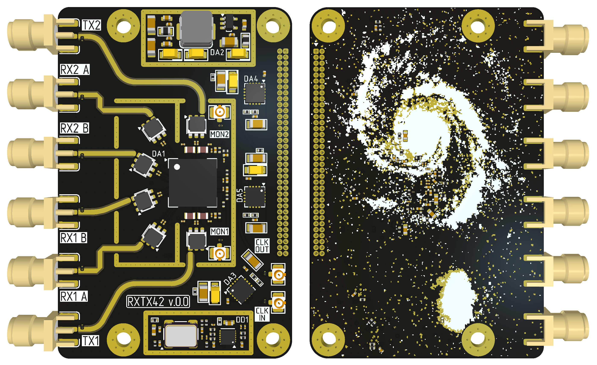

# RXTX42_ver.0.0

SDR Receiver/Transceiver module, based on AD9363 with on-board clock generator and power management circuitry.

**Specification**
- 4 RX channel (edge SMA);
- 2 TX channel (edge SMA);
- External clock input (U.FL);
- External clock output (U.FL);
- Power supply: 3.3...5 V;
- Board size: 50x75x9.5 mm;

    

Board View

